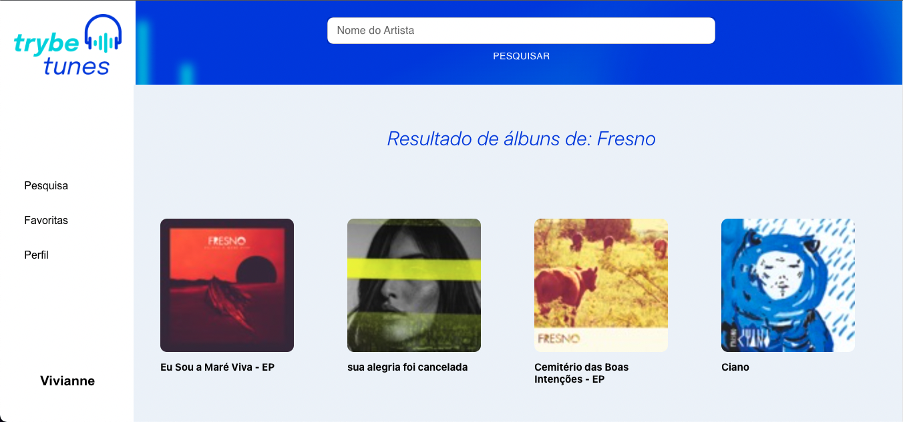
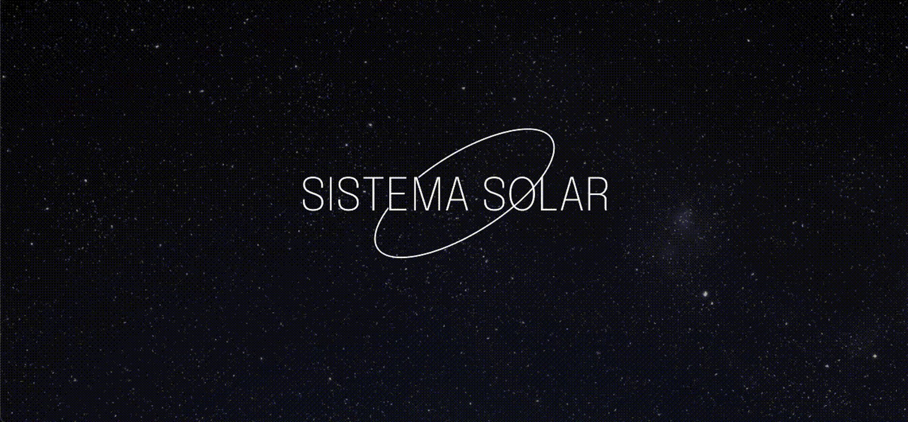
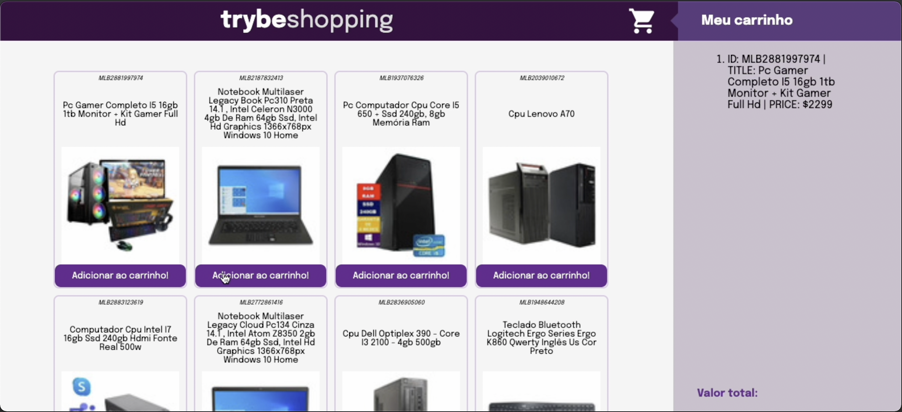
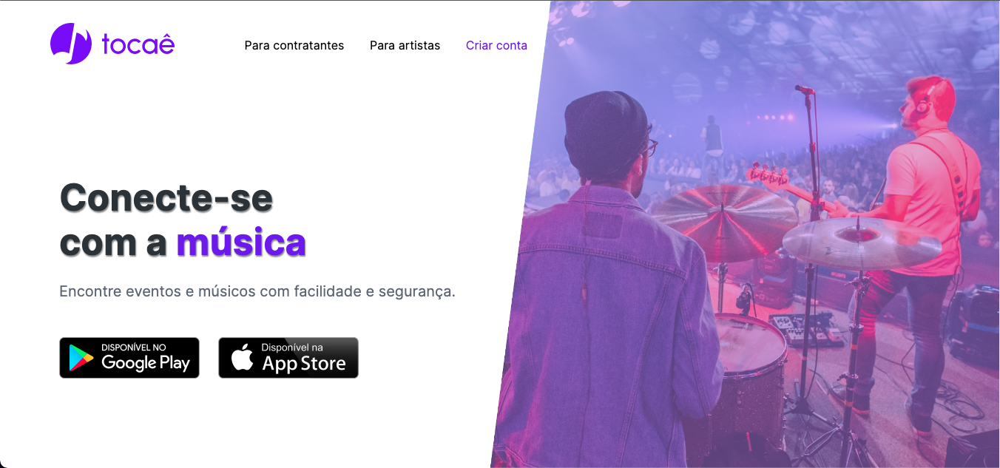
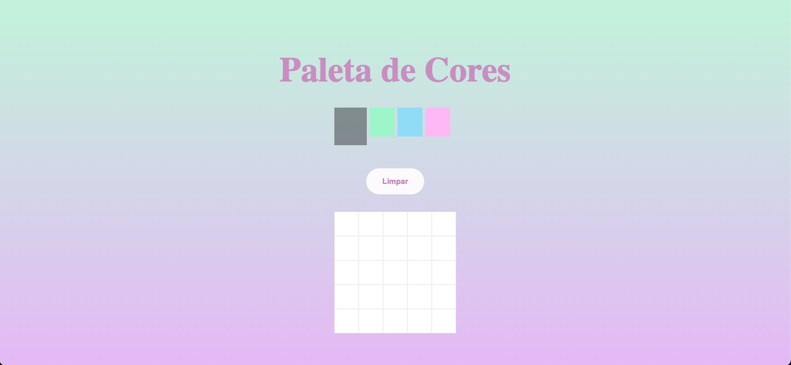
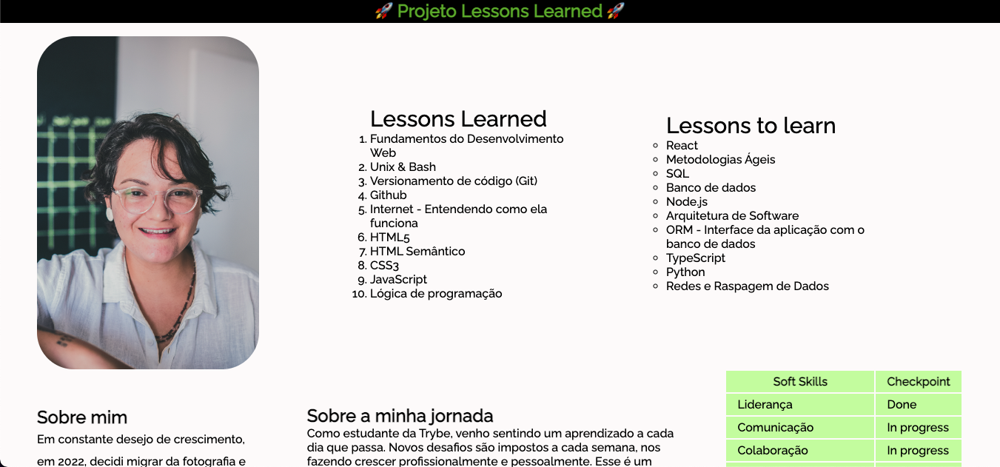

# Hello world! :v::grin:

## Bem-vinda, bem-vindo, bem-vinde ao meu GitHub!

- 💻 Atualmente sou estudante de Desenvolvimento Web Full Stack na [Trybe](https://www.betrybe.com/)
- 🔍 Em busca de uma oportunidade como Front-end
- 🌱 Entusiasta com tudo o que é criativo e curioso

 

<a href="https://github.com/viviannemelo">

 <h2 align="center">Ferramentas e Tecnologias</h2>

        
  

<!-- 

  

 
  

 -->

## Entre em contato comigo:

  

  
  
<h1 align="center">Projetos</h1>
<table align="center">
  <tr>
    <td valign="top" width="50%">
      <h2 align="center"><a href="https://github.com/viviannemelo/project-trybetunes-trybe">Trybetunes (TRYBE)</a></h2>
      
       
       
      
<em><strong>Ferramentas:</strong> React, HTML, CSS, JavaScript ES6+ e MUI</em>

      <ul>
        <li>Desenvolvimento com React;</li>
        <li>Consumo de API;</li>
        <li>Criar rotas, mapeando o caminho da URL com o componente correspondente, via Route;</li>
        <li>Utilizar a função setState;</li>
        <li>MUI para estilização;</li>
      </ul>
    </td>
     <td valign="top" width="50%">
      <h2 align="center"><a href="https://github.com/viviannemelo/project-solar-system-trybe">Solar System (TRYBE)</a></h2>
      
       
       
      
<em><strong>Ferramentas:</strong> React, HTML, CSS e JavaScript ES6+</em>

      <ul>
        <li>Desenvolvimento com HTML, CSS e JavaScript;</li>
        <li>Utilizar JSX no React;</li>
        <li>Utilizar componentes para diferentes arquivos;</li>
        <li>Utilizar componentes de classe;</li>
        <li>Utilizar ProtoTypes para validação de props;</li>
      </ul>
    </td>
  </tr>
  <tr>
    <td valign="top" width="50%">
      <h2 align="center"><a href="https://github.com/viviannemelo/project-shopping-cart-trybe">Shopping Cart (TRYBE)</a></h2>
      
       
       
      
<em><strong>Ferramentas:</strong> React, HTML, CSS, JavaScript ES6+ e Jest</em>

      <ul>
        <li>Desenvolvimento com HTML, CSS e JavaScript;</li>
        <li>Implementar testes utilizando Jest;</li>
        <li>Utilizar componentes para diferentes arquivos;</li>
        <li>Buscar dados de uma API;</li>
        <li>Armazenar dados no localStorage.</li>
      </ul>
    </td>
<td valign="top" width="50%">
     <h2 align="center"><a href="https://github.com/viviannemelo/project-trybe-zoo-function">Zoo Function (TRYBE)</a></h2>
     
      
      
     
<em><strong>Ferramentas: </strong>JavaScript ES6+</em>

     <ul>
       <li>Arrow functions, template literals;</li>
       <li>Spread Operator e Object destructing;</li>
       <li>HOFs em arrays;</li>
       <li>Testes unitários - TDD;</li>
     </ul>
    </td>
  </tr>
  <tr>
<td valign="top" width="50%">
     <h2 align="center"><a href="https://github.com/viviannemelo/plataforma-tocae">Plataforma Tocaê</a></h2>
     
      
      
     
<em><strong>Ferramentas: </strong>HTML e CSS</em>

     <ul>
       <li>Estruturar uma página com HTML;</li>
       <li>Aplicar CSS para estilizar;</li>
       <li>Construir página do zero;</li>
       <li>Aplicar Layout e Box Model;</li>
     </ul>
    </td>
      <td valign="top" width="50%">
      <h2 align="center"><a href="https://github.com/viviannemelo/project-pixels-art-trybe">Pixels Art (TRYBE)</a></h2>
      
       
       
      
<em><strong>Ferramentas:</strong> HTML, CSS e JavaScript ES6+</em>

      <ul>
        <li>Desenvolvimento com HTML, CSS e JavaScript;</li>
        <li>Manipulação do DOM para acessar elementos HTML;</li>
        <li>Criar interatividade em página utilizando event listeners.</li>
      </ul>
     </td>
  </tr>
  <tr>
    </td>
  <td valign="top" width="50%">
  <h2 align="center"><a href="https://github.com/viviannemelo/project-lessons-learned-trybe">Lessons Learned (TRYBE)</a></h2>
  
   
   
  
<em><strong>Ferramentas:</strong> HTML e CSS</em>

  <ul>
    <li>Estruturar uma página com HTML;</li>
    <li>Aplicar CSS para estilizar;</li>
    <li>Construir página do zero;</li>
    <li>Aplicar Layout e Box Model;</li>
    <li>Utilizar links externos;</li>
  </ul>
    </td>
  </tr>
</table>
