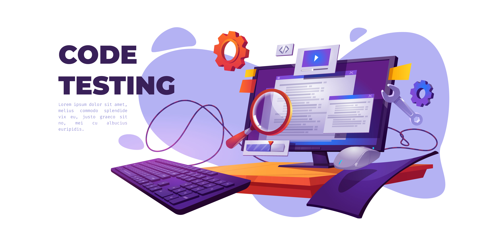
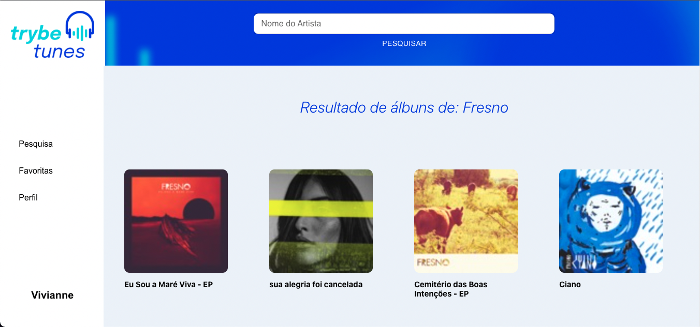
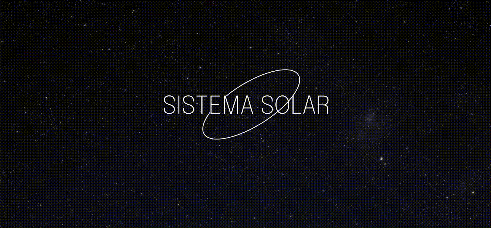
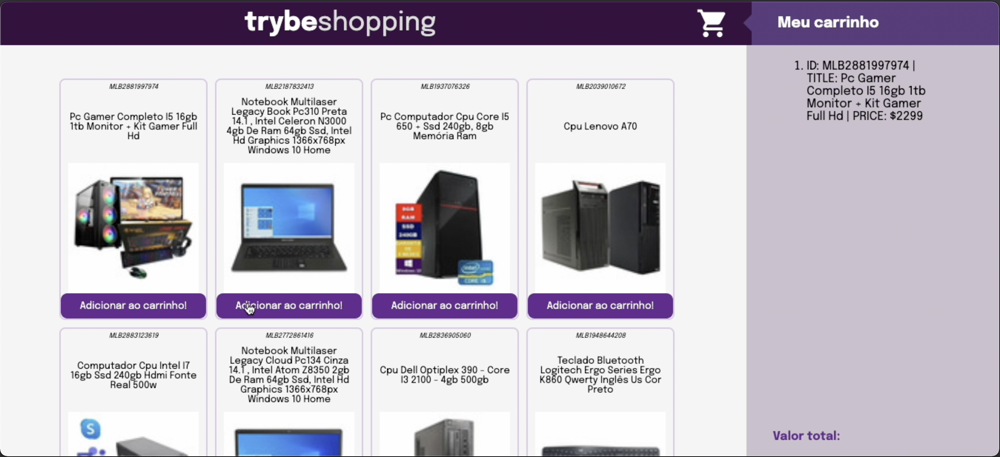
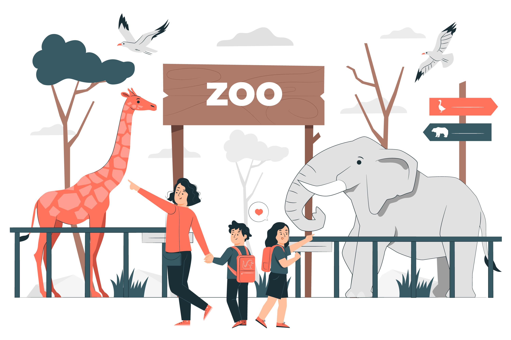
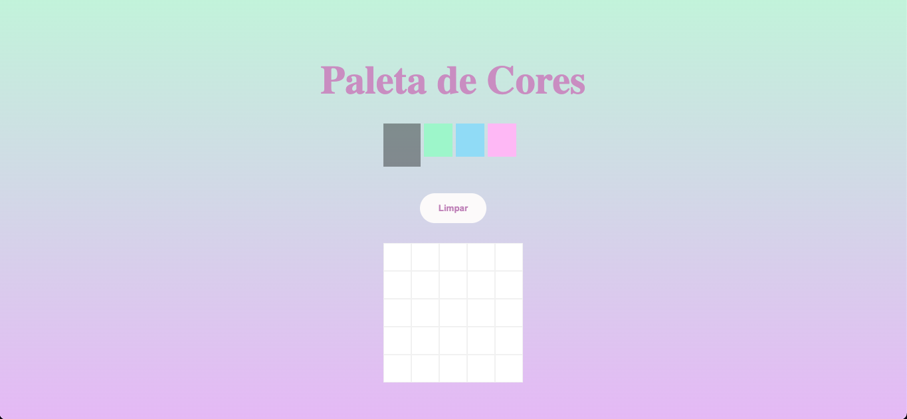
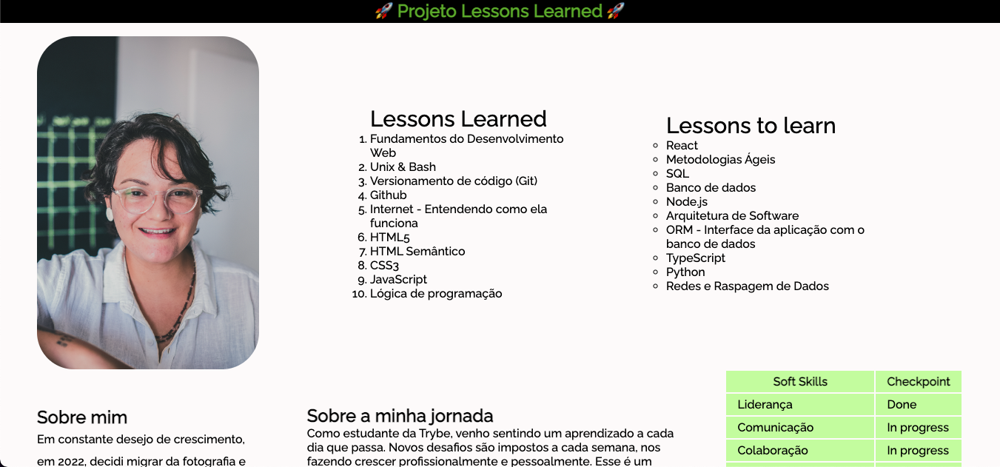

💻 QA Engineer | Test Automation | AI-driven QA

Experiência em automação front-end, back-end, mobile e performance testing, atuando na construção de frameworks escaláveis, melhoria contínua de processos de qualidade e automação operacional com IA. Experiência em liderança técnica de múltiplos projetos, desenvolvimento de soluções utilizando Playwright, testes de performance e integração de pipelines CI/CD.

### Contato:

  

### Escritas:
<a>https://medium.com/@viviannemelo</a>

<h2 align="center">EXPERIÊNCIAS</h2>

SigmaMD, QA Engineer (AGO 2025 - Atualmente)

<ul>
 <li>Desenvolvimento de automações front-end e back-end utilizando Playwright, aumentando a cobertura automatizada dos fluxos críticos da aplicação e reduzindo esforço manual em regressões.</li>
<li>Estruturação de frameworks de testes escaláveis e reutilizáveis, acelerando a criação de novos cenários automatizados e melhorando a manutenção dos testes.</li>
<li>Implementação de testes de performance e monitoramento contínuo, apoiando a identificação preventiva de gargalos.
<li>Criação de soluções com IA utilizando Claude Code para otimizar processos internos de QA, reduzindo tarefas operacionais repetitivas e aumentando a produtividade do time.</li>
<li>Automação de processos internos da empresa, diminuindo tempo gasto em atividades manuais e melhorando a eficiência operacional entre equipes.</li>
<li>Atuação direta no suporte ao cliente, analisando incidentes críticos, reproduzindo problemas e acelerando o fluxo de resolução junto ao time técnico.</li>
<li>Participação ativa em refinamentos técnicos e definição de critérios de aceitação, contribuindo para redução de retrabalho e maior previsibilidade das entregas.</li>
<li>Monitoramento de métricas de qualidade e bugs críticos, apoiando tomadas de decisão orientadas por dados para evolução do produto.
</li>
</ul>

Zoocha, QA Engineer/QA Lead (JUL 2024 - AGO 2025)

<ul>
 <li>Liderança de QA em 8 projetos simultâneos, definindo estratégias de testes, priorização de riscos e garantindo estabilidade contínua das entregas em ambientes ágeis.</li>
<li>Referência interna em acessibilidade, promovendo boas práticas, padronizações e suporte técnico para evolução da conformidade dos projetos.</li>
<li>Execução de testes cross-browser e mobile, reduzindo inconsistências de comportamento entre navegadores e dispositivos.</li>
<li>Validação de UI/UX e responsividade, contribuindo para melhoria da experiência do usuário e redução de falhas visuais em produção.</li>
<li>Condução de testes exploratórios estratégicos para identificação antecipada de falhas críticas e cenários não previstos nos requisitos.</li>
<li>Coordenação de testes de aceitação com clientes (UAT), garantindo alinhamento entre entregas técnicas e expectativas de negócio.</li>
<li>Implementação de melhorias contínuas nos processos de QA, aumentando a eficiência operacional do time e a qualidade das entregas.</li>
<li>Desenvolvimento de documentações e fluxos de qualidade, facilitando onboarding técnico e padronização entre projetos.
</li>
</ul>

RD Saúde, QA Engineer (SET 2023 - JUL 2024)

<ul>
 <li>Planejamento e execução de testes de performance utilizando Locust, contribuindo para validação de escalabilidade e estabilidade das aplicações sob carga.</li>
<li>Monitoramento de aplicações com Datadog, auxiliando na identificação de gargalos e análise de comportamento em tempo real.</li>
<li>Implementação de automação de APIs e backend utilizando Postman, Ruby, HTTParty e Cucumber, reduzindo falhas de integração entre serviços.</li>
<li>Estruturação e manutenção de testes automatizados front-end, garantindo maior confiabilidade das entregas e redução de bugs regressivos.</li>
<li>Escrita e organização de casos de teste com foco em rastreabilidade, cobertura funcional e alinhamento com regras de negócio.</li>
<li>Colaboração com times de desenvolvimento e DevOps em ambiente ágil, contribuindo para melhoria contínua da qualidade e estabilidade.</li>
</ul>

Prosystem, QA Engineer/Tester (FEV 2023 - SET 2023)

<ul>
 <li>Planejamento de estratégias de testes para sistema SaaS B2B, garantindo estabilidade de fluxos críticos de negócio.</li>
<li>Criação de cenários de testes detalhados com foco em regras de negócio, integrações entre módulos e validação funcional de processos empresariais.</li>
<li>Desenvolvimento de automação utilizando Cypress integrado ao ecossistema TypeScript, aumentando a confiabilidade dos testes de interface.</li>
<li>Estruturação de evidências e relatórios de testes, reduzindo tempo de análise de falhas pelas equipes de desenvolvimento.</li>
<li>Identificação de melhorias funcionais e técnicas relacionadas à usabilidade, performance e cobertura de testes, contribuindo para evolução contínua do produto.
</li>
<li>Reporte e acompanhamento de bugs, acelerando a comunicação entre QA e Desenvolvimento.</li>
</ul>

 <h2 align="center">Tools & Technologies</h2>

 

 
  

  

  
<h1 align="center">Projetos</h1>
<table align="center">
   <tr>
    <td valign="top" width="50%">
      <h2 align="center"><a href="https://github.com/viviannemelo/automated-api-testing-httparty">API testing with HTTParty + Rspec</a></h2>
      
       
       
      
<em><strong>Ferramentas:</strong> HTTParty e Rspec</em>

      <ul>
        <li>Automação de testes;</li>
        <li>Ruby;</li>
        <li>Teste de API;</li>
      </ul>
     </td>
    <td valign="top" width="50%">
      <h2 align="center"><a href="https://github.com/viviannemelo/cep-api-test">CEP API Test</a></h2>
      
       
       
      
<em><strong>Ferramentas:</strong> HTTParty e Postman</em>

      <ul>
        <li>Automação de testes;</li>
        <li>Teste de API;</li>
        <li>BDD;</li>
        <li>Gherkin;</li>
      </ul>
     </td>
   </tr>
   <tr>
    <td valign="top" width="50%">
      <h2 align="center"><a href="https://github.com/viviannemelo/react-testing-library-trybe">React Testing Library (TRYBE)</a></h2>
      
       
       
      
<em><strong>Ferramentas:</strong> React Testing Library</em>

      <ul>
        <li>Testes Unitários;</li>
        <li>Testar fluxos lógicos assíncronos;</li>
        <li>Testar inputs.</li>
        <li>Utilizar queries e mocks;</li>
      </ul>
    </td>
     <td valign="top" width="50%">
      <h2 align="center"><a href="https://github.com/viviannemelo/javascript-unit-tests">Javascript Unit Tests</a></h2>
      
       
       
      
<em><strong>Ferramentas:</strong> Jest e NodeJS</em>

      <ul>
        <li>Desenvolvimento de testes em JavaScript;</li>
        <li>TDD;</li>
        <li>Teste de regressão;</li>
        <li>Desenvolvimento de funções baseadas em testes existentes</li>
      </ul>
    </td>
  </tr>
  <tr>
    <td valign="top" width="50%">
      <h2 align="center"><a href="https://github.com/viviannemelo/project-trybetunes-trybe">Trybetunes (TRYBE)</a></h2>
      
       
       
      
<em><strong>Ferramentas:</strong> React, HTML, CSS, JavaScript ES6+ e MUI</em>

      <ul>
        <li>Desenvolvimento com React;</li>
        <li>Consumo de API;</li>
        <li>Criar rotas, mapeando o caminho da URL com o componente correspondente, via Route;</li>
        <li>Utilizar a função setState;</li>
        <li>MUI para estilização;</li>
      </ul>
    </td>
     <td valign="top" width="50%">
      <h2 align="center"><a href="https://github.com/viviannemelo/project-solar-system-trybe">Solar System (TRYBE)</a></h2>
      
       
       
      
<em><strong>Ferramentas:</strong> React, HTML, CSS e JavaScript ES6+</em>

      <ul>
        <li>Desenvolvimento com HTML, CSS e JavaScript;</li>
        <li>Utilizar JSX no React;</li>
        <li>Utilizar componentes para diferentes arquivos;</li>
        <li>Utilizar componentes de classe;</li>
        <li>Utilizar ProtoTypes para validação de props;</li>
      </ul>
    </td>
  </tr>
  <tr>
    <td valign="top" width="50%">
      <h2 align="center"><a href="https://github.com/viviannemelo/project-shopping-cart-trybe">Shopping Cart (TRYBE)</a></h2>
      
       
       
      
<em><strong>Ferramentas:</strong> React, HTML, CSS, JavaScript ES6+ e Jest</em>

      <ul>
        <li>Desenvolvimento com HTML, CSS e JavaScript;</li>
        <li>Implementar testes utilizando Jest;</li>
        <li>Utilizar componentes para diferentes arquivos;</li>
        <li>Buscar dados de uma API;</li>
        <li>Armazenar dados no localStorage.</li>
      </ul>
    </td>
<td valign="top" width="50%">
     <h2 align="center"><a href="https://github.com/viviannemelo/project-trybe-zoo-function">Zoo Function (TRYBE)</a></h2>
     
      
      
     
<em><strong>Ferramentas: </strong>JavaScript ES6+</em>

     <ul>
       <li>Arrow functions, template literals;</li>
       <li>Spread Operator e Object destructing;</li>
       <li>HOFs em arrays;</li>
       <li>Testes unitários - TDD;</li>
     </ul>
    </td>
  </tr>
  <tr>
<td valign="top" width="50%">
     <h2 align="center"><a href="https://github.com/viviannemelo/plataforma-tocae">Plataforma Tocaê</a></h2>
     
      
      
     
<em><strong>Ferramentas: </strong>HTML e CSS</em>

     <ul>
       <li>Estruturar uma página com HTML;</li>
       <li>Aplicar CSS para estilizar;</li>
       <li>Construir página do zero;</li>
       <li>Aplicar Layout e Box Model;</li>
     </ul>
    </td>
      <td valign="top" width="50%">
      <h2 align="center"><a href="https://github.com/viviannemelo/project-pixels-art-trybe">Pixels Art (TRYBE)</a></h2>
      
       
       
      
<em><strong>Ferramentas:</strong> HTML, CSS e JavaScript ES6+</em>

      <ul>
        <li>Desenvolvimento com HTML, CSS e JavaScript;</li>
        <li>Manipulação do DOM para acessar elementos HTML;</li>
        <li>Criar interatividade em página utilizando event listeners.</li>
      </ul>
     </td>
  </tr>
  <tr>
    </td>
  <td valign="top" width="50%">
  <h2 align="center"><a href="https://github.com/viviannemelo/project-lessons-learned-trybe">Lessons Learned (TRYBE)</a></h2>
  
   
   
  
<em><strong>Ferramentas:</strong> HTML e CSS</em>

  <ul>
    <li>Estruturar uma página com HTML;</li>
    <li>Aplicar CSS para estilizar;</li>
    <li>Construir página do zero;</li>
    <li>Aplicar Layout e Box Model;</li>
    <li>Utilizar links externos;</li>
  </ul>
    </td>
  </tr>
</table>
